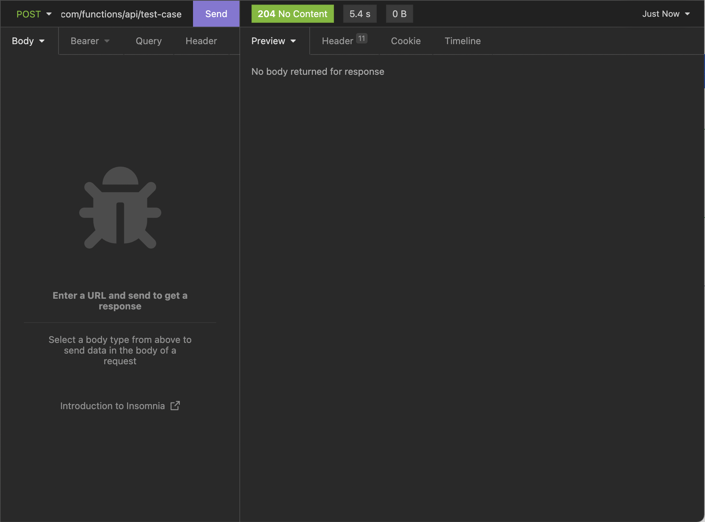
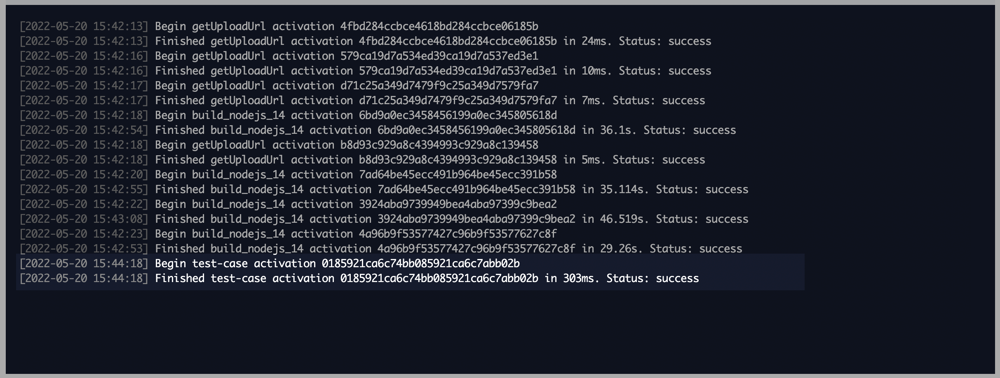
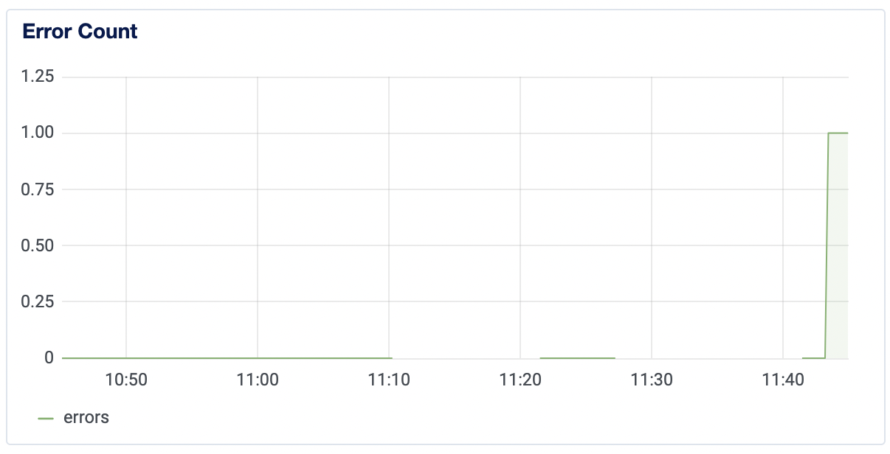
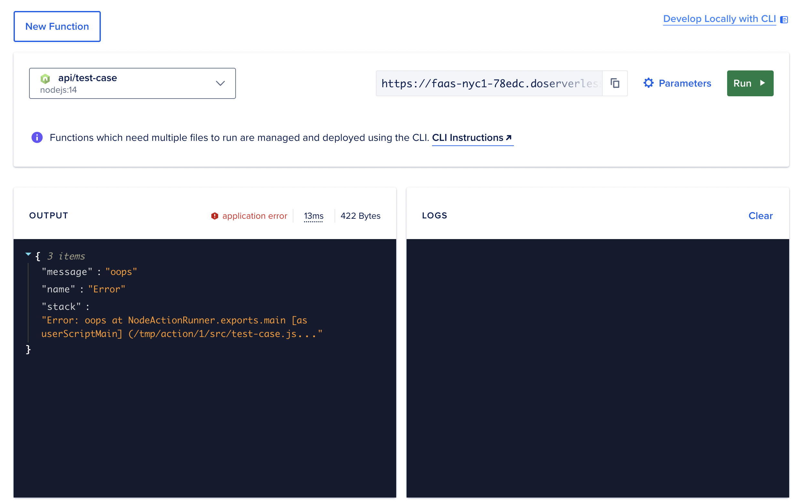

# DO serverless test case - error returns HTTP 204

This test case contains a function named `test-case` in the `api` package, which runs into an error early on. 

Normally, this would result in the function returning an HTTP 400 (Bad Request).

However, if you run this as an App Platform managed function, the function returns an HTTP 204 (No Body). 

The Runtime Logs in DO indicate that the function ran successfully, but the Insights tab will indicate that an error is occurring.

## Screenshots of the above claims

I added this test function to my App Platform app, and called it. Here are the results:

HTTP 204 response in Insomnia:  

Logs in DO's Runtime Logs tab indicating a success:  

Error in DO's Insights tab:  

---

I also added this test function to my functions sandbox on DO. Here are the results in the UI:

## Async vs sync

Making the function non-`async` fixes the issue. So perhaps the issue is related to the way rejected promises are handled in async serverless functions.